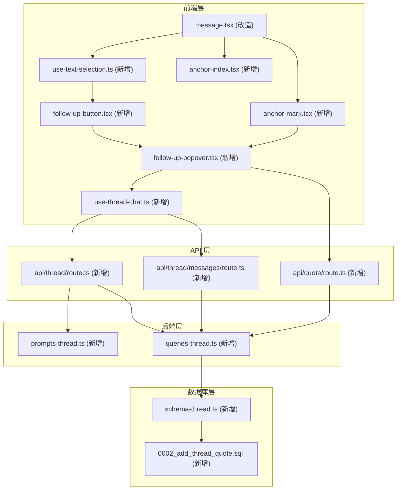
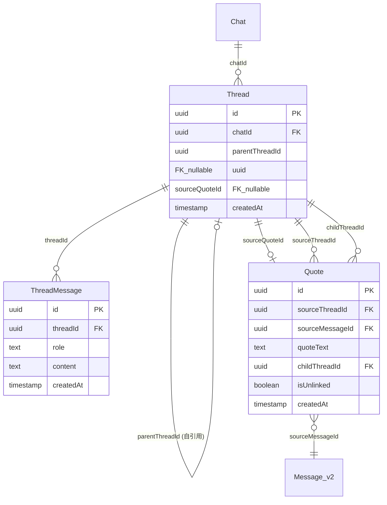
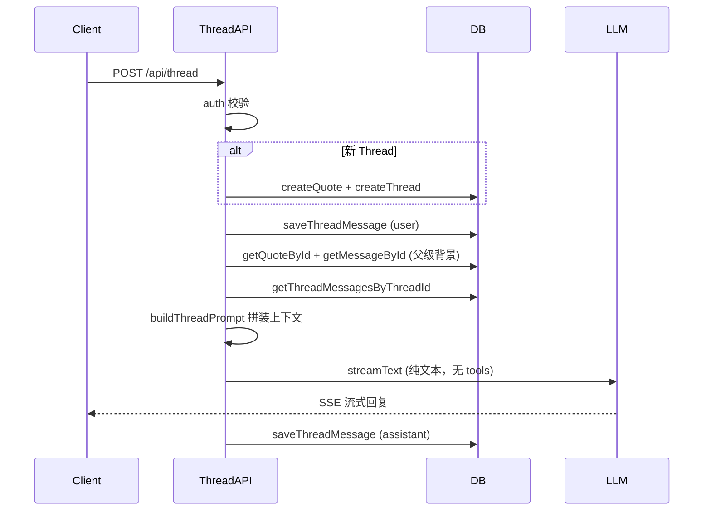
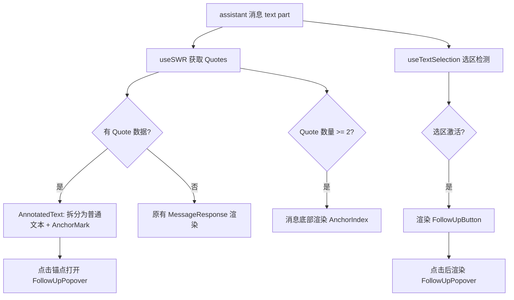

# FlowChat v1 全栈实施方案

## 项目背景

将现有的通用聊天工具升级为"学习型 AI 产品"，核心交互是**划词追问**：用户在 AI 回复中选中文字，原位弹出轻量追问框，形成可持久化、可再次进入的认知锚点。

## 架构总览



## 数据模型



核心设计决策（来自 [core-logic.md](docs/core-logic.md)）：
- **存的时候是"树"**：Thread 通过 parentThreadId 形成无限嵌套
- **发的时候是"短链"**：只携带直接父级的 AI 回答 + 划中文字 + 当前 Thread 内的对话历史

---

## Task 1: 数据库 Schema — Thread 和 Quote 表

**新增文件：**
- `lib/db/schema-thread.ts` — Thread、Quote、ThreadMessage 三张表的 Drizzle schema
- `lib/db/migrations/0002_add_thread_quote.sql` — 迁移 SQL

**修改文件：**
- [lib/db/schema.ts](lib/db/schema.ts) — 底部 re-export 新 schema

**关键要点：**
- 表名沿用项目 PascalCase 惯例（`"Thread"`, `"Quote"`, `"ThreadMessage"`）
- Thread 和 Quote 之间存在循环外键（Thread.sourceQuoteId -> Quote.id, Quote.childThreadId -> Thread.id），需要先建 Thread 表，再建 Quote 表，最后 ALTER 添加 Thread.sourceQuoteId 的外键约束
- Quote 表包含 `isUnlinked` boolean 字段用于软删除（解除锚点可视化关联）
- 迁移文件需要同步更新 `lib/db/migrations/meta/_journal.json` 的 entries 数组
- 建立索引：`idx_thread_chatId`, `idx_quote_sourceMessageId`, `idx_quote_childThreadId`, `idx_threadMessage_threadId`

---

## Task 2: 数据库查询函数

**新增文件：**
- `lib/db/queries-thread.ts` — Thread/Quote/ThreadMessage 的 CRUD 函数

**修改文件：**
- [lib/db/queries.ts](lib/db/queries.ts) — 在 `deleteChatById` 和 `deleteAllChatsByUserId` 中级联删除 Thread 数据

**查询函数清单：**
- `createThread` / `getThreadById`
- `createQuote` / `getQuoteById` / `getQuotesByMessageId`（过滤 isUnlinked=false）
- `unlinkQuote` / `unlinkAllQuotesByMessageId`
- `saveThreadMessage` / `getThreadMessagesByThreadId`
- `deleteThreadDataByChatId` — 级联删除，注意处理循环外键：先删 ThreadMessage -> 置空 sourceQuoteId -> 删 Quote -> 删 Thread

**代码风格：** 沿用现有 [lib/db/queries.ts](lib/db/queries.ts) 的模式——`import "server-only"`, 使用 `ChatbotError`, try/catch 包裹

---

## Task 3: 追问 Prompt 拼装

**新增文件：**
- `lib/ai/prompts-thread.ts`

**核心函数 `buildThreadPrompt`：**

拼装结构严格遵循 [core-logic.md](docs/core-logic.md) 第三节：

```
1. System Prompt（学习助手风格）
2. 父级 AI 回答完整内容（固定背景，不参与滑动窗口）
3. 划选文字 + 第一轮追问（合并为一条 user 消息）
4. Thread 内后续多轮对话（应用滑动窗口，默认保留最近 40 条）
```

关键约束：**系统只看直接父级，坚决不向更上层追溯。** 无论嵌套多少层，每层只携带被划词的那条回答和划中的文字。

---

## Task 4: 追问 API 路由

**新增文件：**
- `app/(chat)/api/thread/route.ts` — POST: 发送追问消息并流式回复
- `app/(chat)/api/thread/messages/route.ts` — GET: 获取 Thread 消息列表
- `app/(chat)/api/quote/route.ts` — GET/DELETE: Quote CRUD

**Thread POST 路由核心流程：**



**与现有 chat API 的差异：**
- 参考 [app/(chat)/api/chat/route.ts](app/(chat)/api/chat/route.ts) 的 `streamText` + `createUIMessageStream` 模式
- 不使用 tools（追问场景不需要 Artifact 等工具），只做纯文本对话
- 使用 `prompts-thread.ts` 的 `buildThreadPrompt` 替代 `systemPrompt`
- 消息存储到 ThreadMessage 而非 Message_v2

**Quote API：**
- GET `?messageId=xxx` — 返回该消息上所有未 unlink 的 Quote，附带每个 Quote 对应 Thread 的消息数量（用于轮次徽章）
- DELETE `{ quoteId }` — 单个软删除
- DELETE `{ messageId }` — 批量软删除

---

## Task 5: 文本选区检测 Hook

**新增文件：**
- `hooks/use-text-selection.ts`

**功能（参考 [inline-popover-design.md](docs/inline-popover-design.md) 第二节）：**
- 监听指定容器 ref 内的 `mouseup` 事件
- mouseup 后延迟 ~150ms 检查 `window.getSelection()`
- 验证选区非空、在 assistant 消息文本范围内、不在代码块内
- 返回 `{ text, rect, messageId, isActive }`，rect 用于定位追问按钮
- 点击空白处、选区变化、页面滚动时清除状态

---

## Task 6: 追问对话 Hook

**新增文件：**
- `hooks/use-thread-chat.ts`

**功能：**
- 接收参数：`chatId`, `sourceMessageId`, `quoteText`, `sourceThreadId`, `existingThreadId?`, `selectedChatModel`
- 状态管理：`messages`, `status` (idle/streaming/error), `threadId`
- `sendMessage(text)` — POST 到 `/api/thread`，使用 fetch + ReadableStream 解析 SSE 流式响应
- `loadHistory(threadId)` — GET `/api/thread/messages`，加载已有对话
- `stop()` — 中断当前流式请求（AbortController）

---

## Task 7: 追问按钮组件

**新增文件：**
- `components/chat/follow-up-button.tsx`

**设计（参考 [inline-popover-design.md](docs/inline-popover-design.md) 第二节）：**
- 绝对定位于选区正下方居中（相对于消息容器）
- 入场/出场动画（framer-motion: opacity + translateY）
- 包含对话气泡图标（lucide-react `MessageSquareQuote`）+ "追问"文字
- 点击空白处或选区变化时消失

---

## Task 8: 追问 Popover 组件（核心组件）

**新增文件：**
- `components/chat/follow-up-popover.tsx`

**三区结构（参考 [inline-popover-design.md](docs/inline-popover-design.md) 第三、五节）：**
- **Header**：图标 + "追问" + 引用文字（truncate）+ 轮次徽章 + 关闭按钮。嵌套时显示面包屑导航
- **Conversation 区域**：初始隐藏，有消息后出现。超过 2 轮时历史 AI 回复折叠为单行摘要。支持 Markdown 渲染（复用现有 `MessageResponse` 组件）
- **Input 区域**：textarea + 发送/停止按钮

**定位策略：**
- 优先选区正下方，空间不足时翻转到上方
- 水平修正防止超出视口
- 相对于消息容器定位（滚动跟随）

**嵌套追问：**
- Popover 内的 AI 回复也集成选区检测
- 用户在 Popover 内选中文字并追问时，内容平滑切换为新层级（替换 + 面包屑），不打开新 Popover
- 面包屑超过 3 层时折叠为 `... > [当前层]`

**关闭行为：**
- x 按钮 / Esc / 点击外部 / 打开另一个追问 -> 关闭
- 关闭时如果已发送过消息，通知父组件创建锚点
- 同一时刻只能打开一个 Popover

---

## Task 9: 认知锚点组件

**新增文件：**
- `components/chat/anchor-mark.tsx` — 锚点渲染（虚线下划线 + 上标数字徽章）
- `components/chat/anchor-index.tsx` — 消息底部锚点索引栏

**AnchorMark（参考 [inline-popover-design.md](docs/inline-popover-design.md) 第四节）：**
- 渲染带品牌色虚线下划线的 `<span>`
- 文字后显示上标轮次数字
- Hover 时下划线变实线，鼠标变 pointer
- 右键菜单提供"解除追问标记"选项
- 点击打开对应的 Popover

**AnchorIndex（参考第六节）：**
- 可折叠面板，默认收起
- 标题显示锚点数量
- 展开后列出每个锚点的引用文字和轮数
- 支持单个解除和全部清除

---

## Task 10: 集成到消息组件

**修改文件：**
- [components/chat/message.tsx](components/chat/message.tsx)

**改造 `PurePreviewMessage` 中 assistant 消息的 `type === "text"` 部分：**



**关键改动点：**
1. 用 `useSWR` 请求 `/api/quote?messageId=xxx` 获取锚点数据
2. 新增 `AnnotatedText` 内部组件：根据 Quote 的 quoteText 将原文拆分为交替的普通文本段和 AnchorMark 段
3. 在 assistant 消息文本容器上挂载 `useTextSelection`
4. 维护 `activePopover` 状态，同一时刻只打开一个 Popover
5. Quote >= 2 时在消息底部渲染 AnchorIndex
6. 需要向下透传 `chatId` 和 `selectedChatModel`（可能需要新增 prop 或从 context 获取）

---

## Task 11: 端到端验收与边界处理

验证 PRD 第 8 节定义的四条用户旅程：

- **旅程 A**：主线提问 -> 选中文字 -> 追问按钮 -> Popover 展开 -> 流式回复 -> 关闭 -> 锚点出现
- **旅程 B**：Popover 内多轮追问 -> 历史折叠 -> 轮次徽章正确
- **旅程 C**：点击锚点 -> 重新打开 Popover -> 历史对话已加载 -> 可继续追问
- **旅程 D**：右键锚点 -> 解除追问标记 -> 原文恢复

**边界情况：**
- 同一条 AI 回复上多次划词追问（各自独立）
- Popover 在页面底部时翻转到上方
- 打开新追问时旧 Popover 自动关闭
- 删除 Chat 时 Thread/Quote 数据正确级联删除
- 代码块内文字不触发追问
- 嵌套追问的面包屑导航和层级切换

---

## 文件变更汇总

**新增 13 个文件：**
- `lib/db/schema-thread.ts`
- `lib/db/migrations/0002_add_thread_quote.sql`
- `lib/db/queries-thread.ts`
- `lib/ai/prompts-thread.ts`
- `app/(chat)/api/thread/route.ts`
- `app/(chat)/api/thread/messages/route.ts`
- `app/(chat)/api/quote/route.ts`
- `hooks/use-text-selection.ts`
- `hooks/use-thread-chat.ts`
- `components/chat/follow-up-button.tsx`
- `components/chat/follow-up-popover.tsx`
- `components/chat/anchor-mark.tsx`
- `components/chat/anchor-index.tsx`

**修改 3 个文件：**
- `lib/db/schema.ts` — re-export 新 schema
- `lib/db/queries.ts` — deleteChatById / deleteAllChatsByUserId 级联删除
- `components/chat/message.tsx` — 集成选区检测、锚点渲染、Popover 挂载

**修改 1 个配置文件：**
- `lib/db/migrations/meta/_journal.json` — 追加迁移条目
