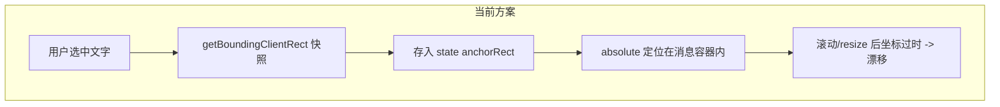
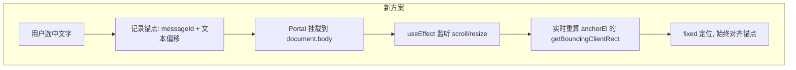

# Popover 定位稳定化方案

## 问题根因

当前方案的三层定位问题：

1. **anchorRect 是一次性快照** -- `selection.rect` 在点击"追问"按钮时获取，之后不再更新。页面滚动、窗口 resize 后坐标全部过时。
2. **absolute 定位在消息容器内** -- Popover 用 `position: absolute` 相对于 `textContainerRef`（单条消息的文本区域）定位。但消息容器本身在滚动容器内，absolute 的参考系随滚动变化。
3. **FollowUpButton 同样的问题** -- 按钮位置基于视口坐标的 `selectionRect`，但用 absolute 定位在消息容器内。



## 修复方案：Portal + 实时锚点追踪

核心思路：**不再把 Popover 放在消息容器内部，而是通过 React Portal 挂载到 body 层级，用 fixed 定位 + 实时追踪锚点元素位置。**



### 具体改动

#### 1. 新增锚点标记元素

在用户点击"追问"后，在选区位置插入一个不可见的 `<span data-thread-anchor>` 标记元素（零宽度，不影响布局）。Popover 通过这个 DOM 元素实时获取位置，而不是依赖一次性的 `DOMRect` 快照。

- 文件：[`components/chat/message.tsx`](components/chat/message.tsx)
- 在 `handleFollowUp` 中，将 `anchorRect` 改为存储 `anchorElementId`（一个唯一 ID）
- 在选区位置插入锚点 span

#### 2. FollowUpPopover 改为 Portal + fixed 定位

- 文件：[`components/chat/follow-up-popover.tsx`](components/chat/follow-up-popover.tsx)
- 用 `createPortal` 挂载到 `document.body`
- 用 `position: fixed` 替代 `position: absolute`
- 新增 `useEffect` 监听滚动容器的 `scroll` 事件和 `window.resize`
- 每次事件触发时，通过 `anchorEl.getBoundingClientRect()` 实时更新位置
- 翻转逻辑（上/下）和水平修正逻辑保持不变，但基于实时视口坐标

#### 3. FollowUpButton 同样改为 Portal + fixed

- 文件：[`components/chat/follow-up-button.tsx`](components/chat/follow-up-button.tsx)
- 同样用 Portal + fixed 定位
- 位置基于 `selectionRect` 的实时视口坐标（selection rect 本身就是视口坐标，只需要去掉相对于容器的偏移计算）

#### 4. 简化 ActivePopoverState

- 文件：[`components/chat/message.tsx`](components/chat/message.tsx)
- `ActivePopoverState` 不再存储 `anchorRect: DOMRect`
- 改为存储 `anchorId: string`（锚点 span 的 ID）
- 移除 `containerRef` prop 传递（不再需要）

### 关键代码结构

**FollowUpPopover 的定位 hook（新增）：**

```typescript
function useAnchorPosition(anchorId: string) {
  const [pos, setPos] = useState({ top: 0, left: 0, flip: false });

  useEffect(() => {
    const anchor = document.getElementById(anchorId);
    if (!anchor) return;

    const update = () => {
      const rect = anchor.getBoundingClientRect();
      const popoverH = 400;
      const spaceBelow = window.innerHeight - rect.bottom;
      const flip = spaceBelow < popoverH + 16;

      setPos({
        top: flip ? rect.top - popoverH - 8 : rect.bottom + 8,
        left: Math.max(8, Math.min(rect.left, window.innerWidth - 388)),
        flip,
      });
    };

    update();

    const scroller = anchor.closest(".overflow-y-auto");
    scroller?.addEventListener("scroll", update, { passive: true });
    window.addEventListener("resize", update, { passive: true });

    return () => {
      scroller?.removeEventListener("scroll", update);
      window.removeEventListener("resize", update);
    };
  }, [anchorId]);

  return pos;
}
```

**Portal 渲染：**

```tsx
return createPortal(
  <motion.div style={{ position: "fixed", top: pos.top, left: pos.left, ... }}>
    {/* popover content */}
  </motion.div>,
  document.body
);
```

### 不变的部分

- `useTextSelection` hook -- 选区检测逻辑不变
- `useThreadChat` hook -- 对话逻辑不变
- 后端 API -- 完全不涉及
- Popover 内部 UI（header、对话区、输入区）-- 不变
